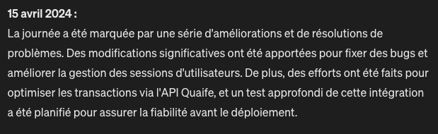

# Auto Activity Report

## Description

This project aims to simplify and automate the extraction and summarization of messages from various communication platforms, starting with Slack. It provides a way to organize and analyze messages for better insights into daily activities and communications within teams.

## Output example



## Getting Started

### Prerequisites

Before you can run this project, you'll need the following installed:
- Node.js (LTS version recommended)
- npm or Yarn

### Installation

1. **Clone the repository**
    ```bash
    git clone git@github.com:MouadCh/auto-activity-report.git
    cd auto-activity-report
    ```

2. **Install dependencies**
    ```bash
    yarn install
    ```

3. **Set up environment variables**
    - Copy the `.env.example` file to `.env`.
    - Fill in the necessary API keys and tokens in the `.env` file.

### Usage

**For development:**

Run the main script to fetch and process messages:
```bash
yarn dev
```

**For production:**


Build the project:
```bash
yarn build
```
Start the application:

```bash
yarn start
```
Runs the compiled JavaScript from the dist directory.

## Contributing

Contributions are what make the open-source community such an amazing place to learn, inspire, and create. Any contributions you make are **greatly appreciated**.

### How to Contribute

1. **Fork the Project**
   - Use the 'Fork' button at the top to create your own copy.

2. **Create your Feature Branch**
   ```bash
   git checkout -b feature/AmazingFeature
   ```

3. **Commit your Changes**
   ```bash
   git commit -m 'Add some AmazingFeature'
   ```

4. **Push to the Branch**
   ```bash
   git push origin feature/AmazingFeature
   ```

5. **Open a Pull Request**

### Suggesting Additional Templates

We are currently supporting Slack message templates. If you have experience with other platforms (e.g., Microsoft Teams, Discord) and wish to contribute templates for these, please feel free to suggest or contribute directly via pull requests.

## License

Distributed under the MIT License. See `LICENSE` for more information.

## Contact

Email : [chaouki.mouad.pro@gmail.com](mailto:chaouki.mouad.pro@gmail.com)
